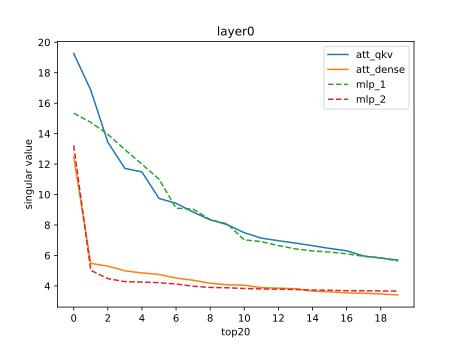
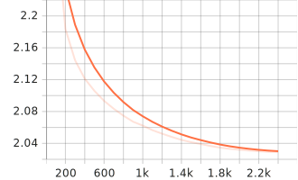
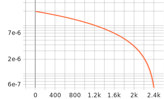

# ChatGlm2-6B_QLoRa
## introduction
This project is an educational initiative that leverages the transformers and peft libraries to implement efficient parameter fine-tuning methods for both the quantized and non-quantized versions of ChatGlm2-6B. Furthermore, it investigates efficient instruction fine-tuning methods for LLM based on the LoRa and AdaLoRa frameworks, to adapt LLM instruction alignment with downstream tasks in low-resource scenarios.

## environment configuration

CUDA >= 11.7

Python
```
torch==2.0.1
transformers==4.30.2
peft==0.4.0.dev0
numpy==1.24.3
loguru==0.7.0
datasets==2.13.2.dev0
dataclasses==0.6
cpm-kernels==1.0.11
bitsandbytes==0.40.0.post4
sentencepiece==0.1.99
accelerate==0.20.3
matplotlib==3.7.1
```

## project directory

### data
The dataset directory primarily consists of Chinese medical question-answering instruction data, which is sourced from the project available at [Med-ChatGLM](https://github.com/SCIR-HI/Med-ChatGLM).

```
{"context": "问题：患者反复出现反酸、烧心等症状，考虑为Barrett食管，需要注意哪些并发症？\n回答: ", "target": "根据知识，Barrett食管的并发症包括消化性溃疡、反流食管炎、胃肠道出血、贫血、肿瘤等，需要引起注意。"}
```

### args_file

This folder contains JSON format configuration files, including LoRa parameters, training parameters, dataset paths, and so on.

### param_matrix

In this folder, the primary focus is on analyzing the original parameter matrix of LLM. This analysis investigates the data distribution of the parameter matrix and performs Singular Value Decomposition (SVD) on the matrix to examine the distribution changes of the parameter matrix with network depth.



### QLora_Adapter_THUDM_chatglm2-6b

This folder contains saved checkpoints during the training process, as well as the final trained adapter weights. It facilitates convenient breakpoint resumption and loading of the LoRa Adapter.It also includes the inference testing code after the current training is completed.

The directory structure within each checkpoint is as follows.

```
total 23M
drwxr-xr-x 2 root root 4.0K Jul 16 09:54 LoraAdapter
-rw-r--r-- 1 root root  23M Jul 16 09:54 optimizer.pt
-rw-r--r-- 1 root root   27 Jul 16 09:54 README.md
-rw-r--r-- 1 root root  15K Jul 16 09:54 rng_state.pth
-rw-r--r-- 1 root root  627 Jul 16 09:54 scheduler.pt
-rw-r--r-- 1 root root 7.5K Jul 16 09:54 trainer_state.json
-rw-r--r-- 1 root root 3.9K Jul 16 09:54 training_args.bin
```

inference code

```
from transformers import AutoModel, AutoTokenizer, BitsAndBytesConfig
import torch
from peft import  PeftModelForCausalLM
from datasets import load_from_disk

quantization_config = BitsAndBytesConfig(
    load_in_4bit=True,
    bnb_4bit_quant_type='nf4',
    bnb_4bit_compute_dtype=torch.float32
)
base_model = AutoModel.from_pretrained('THUDM/chatglm2-6b', trust_remote_code=True, device_map='auto', quantization_config=quantization_config)

tokenizer = AutoTokenizer.from_pretrained('THUDM/chatglm2-6b', trust_remote_code=True)

datasets = load_from_disk(dataset_path='data/Med_datasets.jsonl')

lora_model = PeftModelForCausalLM.from_pretrained(base_model, 'Lora_Adapter_THUDM_chatglm2-6b/finally_adapter/LoraAdapter')

query1 = datasets['train'][1]['context']

target1 = datasets['train'][1]['target']

response1_q, history = lora_model.chat(tokenizer, query=query1, history=[])
```

### picture
This folder contains the images of the train loss and eval loss at each training iteration.

train_loss


eval_loss


learning_rate



## reference

[chatGLM-6B-QLoRA](https://github.com/shuxueslpi/chatGLM-6B-QLoRA)

[Med-ChatGLM](https://github.com/SCIR-HI/Med-ChatGLM)

[ChatGLM2-6B](https://github.com/THUDM/ChatGLM2-6B)
